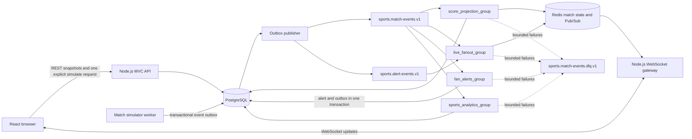

# Sports Scores and Fan Alerts Learning System

This guide describes the sports learning system added alongside the existing OrderStream flow. The project remains one React application, one MVC Node.js backend, and one additive PostgreSQL schema.

## Design target: one million daily active users

DAU counts distinct users during a day. It does not mean that every user holds a live socket at the same time. A useful first estimate is:

```text
average concurrent viewers = DAU × average connected minutes per user per day ÷ 1,440
```

At 1,000,000 DAU, five connected minutes per user per day gives about 3,472 average concurrent viewers; fifteen minutes gives about 10,417. Match popularity creates peaks above those averages, and many daily users may read a snapshot without opening a live match. These examples are arithmetic illustrations, not capacity promises.

The local computer is for understanding the design and measuring a small working slice. It cannot be presented as a one-million-live-connection server. The current Podman WSL machine is configured for 4 vCPU, 4 GiB memory, and 40 GiB disk. Kafka, Redis, and Kafbat UI share that container budget; PostgreSQL, Node.js, and the browser also use host resources. The Kafka broker is a single node with replication factor 1, so it has no broker redundancy.

At the target scale, size the platform from peak live sockets, events per second, fan-out copies per event, retention, and regional traffic. A production deployment would need several WebSocket/API gateways behind a load balancer, a multi-broker Kafka cluster with replicated topics, partition counts chosen from measured peak throughput and key distribution, Redis Cluster or another sharded fan-out design, PostgreSQL high availability and read scaling, and centralized metrics. A million DAU alone does not determine any of those sizes.

The local WebSocket endpoint is an unauthenticated learning endpoint. A production gateway also needs authenticated fan subscriptions, connection limits, heartbeat and stale-client cleanup, bounded outbound buffers, backpressure handling, and regional routing. Those controls need measured limits of their own; they are not implied by the DAU target.

## Architecture and data flow



The browser only talks to the Node API and its `/ws` WebSocket endpoint. It never connects to Kafka. Redis holds a read-through cache of the current score/status and carries live match and fan channels. PostgreSQL remains the durable source for matches, event history, simulation jobs, alerts, outbox rows, and analytics counts.

Backend code follows MVC: routes bind URLs, controllers handle HTTP status and response bodies, services apply use-case rules, and models own SQL. The existing order routes and models remain in place.

## Milestones and what each teaches

1. **Preserve OrderStream and introduce MVC** — keep the existing HTTP contract while separating routes, controllers, services, and models. This teaches where business rules and SQL belong.
2. **Add sports persistence and local services** — add sports tables, Redis, and create-if-absent Kafka topics without changing or clearing OrderStream data. This teaches safe, additive schema evolution and why partition counts are part of the ordering design.
3. **Simulate and consume ordered events** — require an explicit job, persist through an outbox, then run score, fan-out, alert, and analytics groups independently. This teaches message keys, offsets, group progress, idempotency, retries, and dead letters.
4. **Show the stream in React** — use REST snapshots plus a Node WebSocket gateway backed by Redis and Kafka admin metadata. This teaches browser boundaries, live fan-out, consumer lag, and end-to-end latency.
5. **Study reliability and local limits** — use the runbook, acceptance criteria, and guarded local WebSocket probe. This teaches measurement discipline and the gap between a DAU target and simultaneous connection capacity.

### Topics, keys, and partitions

| Topic | Local partitions | Message key | Purpose |
|---|---:|---|---|
| `sports.match-events.v1` | 6 | `matchId` | Ordered kick-off, goal, card, half-time, and full-time events for one match |
| `sports.alert-events.v1` | 3 | `fanId` | Durable alert events for each subscribed fan |
| `sports.match-events.dlq.v1` | 1 | `matchId` where available | Failed-consumer envelope with source topic, partition, offset, group, attempts, and error |

Kafka guarantees order within a partition. The `matchId` key keeps one match on one partition, so sequence 1, 2, 3, … stays ordered for that match. The `fanId` key independently orders each fan's alerts. Partition expansion can move a key to a different partition, so do not casually increase a topic's partition count after it has data. These local topics use replication factor 1 and are not highly available.

The existing `order_events` and `notification_events` topics and their consumers remain separate and unchanged.

### Consumer groups

| Group | Subscriptions | Durable effect |
|---|---|---|
| `score_projection_group` | `sports.match-events.v1` | Validates the next match sequence, stores the event once, updates the PostgreSQL score, then refreshes Redis match state |
| `live_fanout_group` | Match events and alert events | Publishes to `sports:match:<matchId>` and `sports:fan:<fanId>` Redis channels for the WebSocket gateway |
| `fan_alerts_group` | `sports.match-events.v1` | Filters goals, cards, and match completion by team subscriptions; stores each alert and its alert-topic outbox row in one PostgreSQL transaction |
| `sports_analytics_group` | `sports.match-events.v1` | Counts event types by UTC minute and event ID without double counting replay |

Each group has its own Kafka offsets. Members of one group share that group's assigned partitions; a different group processes its own copy and progress. The dashboard reads topic metadata, group state, assignments, committed offsets, and log-end offsets from Kafka's admin API. Kafka metadata polling is cached for five seconds per API process.

## Learning sequence

### 1. Preserve and start the existing project

From PowerShell in `C:\Projects\orderstream_lab`:

```powershell
npm install
npm run infra:up
npm run db:init
```

`npm run db:init` applies the existing OrderStream schema followed by additive sports tables and seed rows. It uses `CREATE TABLE IF NOT EXISTS`, `ALTER TABLE ... ADD COLUMN IF NOT EXISTS`, and `ON CONFLICT DO NOTHING`; it does not clear existing orders, stock, PostgreSQL tables, Kafka topics, or Kafka volumes. Keep the existing `DATABASE_URL` in `backend/.env`.

For the preserved OrderStream experience, the existing `npm run dev` command still starts its API, two original workers, and React page. For a visible sports walkthrough, use separate terminals:

| Terminal | Command | Role |
|---|---|---|
| 1 | `npm run dev:api` | Existing HTTP API plus sports WebSocket gateway |
| 2 | `npm run dev:web` | React dashboard on port 5173 |
| 3 | `npm run sports:simulator` | Claims only explicitly queued simulation jobs |
| 4 | `npm run sports:outbox` | Publishes durable outbox records to Kafka |
| 5 | `npm run sports:score` | Score projection and Redis current state |
| 6 | `npm run sports:fanout` | Redis live fan-out for match and alert messages |
| 7 | `npm run sports:alerts` | Subscription-based durable fan alerts |
| 8 | `npm run sports:analytics` | Idempotent per-minute event counts |

The sports dashboard's **Simulate one match** button queues exactly one selected match. Nothing starts a simulation on page load. Start only the roles needed for the lesson; the OrderStream order and notification workers are not prerequisites for sports.

### 2. Follow a match event

1. Select a scheduled match and explicitly queue its simulation.
2. Observe `sports_simulation_jobs` advance while the simulator appends one event and its outbox row in the same transaction.
3. Watch `sports.match-events.v1` in Kafbat. The key is the selected match ID; compare each sequence with its partition and offset.
4. Compare the score projection, fan alert, live fan-out, and analytics group progress. Stop one role to create lag, then restart it to observe catch-up.
5. Open the reliability notes on the dashboard and compare the live messages with durable PostgreSQL event history.

## Reliability lessons in the implementation

- **Transactional outbox:** the simulator stores an event before Kafka publication. The alert worker stores an alert and its outgoing alert event in the same PostgreSQL transaction. The publisher retries pending rows with exponential backoff and blocks later unpublished rows with the same topic/key until the earlier row is published.
- **At-least-once delivery:** Kafka can accept a send just before a worker loses its database acknowledgement. The outbox may publish that row again after its lease expires. Consumer code uses event IDs, unique constraints, and match sequence checks so a retry does not add a second goal or analytics count.
- **Bounded retries and dead letters:** consumers retry processing three times by default. After that they publish a failure envelope to the DLQ. A source offset is allowed to advance only after the DLQ publish succeeds. A sequence gap marks the match as requiring reconciliation and does not guess at a score.
- **Replay:** a new consumer group starts from the beginning. An existing group resumes from its committed offsets; `fromBeginning` does not reset an established group. Replaying through a new group demonstrates database dedupe. Offset resets should be an intentional learning exercise, never an automatic startup step.
- **Redis and reconnects:** Redis Pub/Sub is live fan-out, not durable storage. A disconnected browser can miss a push. On WebSocket connection the dashboard reloads event history from PostgreSQL, and match reads repopulate an empty Redis state cache from PostgreSQL.
- **Outage boundaries:** PostgreSQL is the durable record. If Redis is unavailable, the API can still return match snapshots from PostgreSQL; the live socket reports that fan-out is waiting. Kafka consumer failures are visible through group lag and the DLQ.

## Local load study plan (not run)

The guarded `backend/scripts/ws-load-study.js` helper opens local WebSockets only. It sends no REST requests, orders, or Kafka messages. It requires an explicit connection count plus `--i-understand-local-load`, accepts localhost URLs only, and caps the run at 1,000 sockets. It does not create sports events. Do not run it until you explicitly choose to conduct a local load study.

Example command for a future, explicitly approved first rung:

```powershell
node backend/scripts/ws-load-study.js --connections 10 --step 10 --step-seconds 30 --i-understand-local-load
```

Increase one rung at a time, for example **10 → 20 → 30 → … → 100 → … → 500** with `--step 10`, and only consider 750 or 1,000 if the earlier readings leave ample headroom. Use `--step` to choose the added sockets per rung and `--step-seconds` to hold the rung. Never jump directly to the script's cap. The script's cap is a guardrail, not a statement that the PC can sustain that many connections.

Before each rung, record an idle baseline. During each rung, record successful and failed handshakes, active sockets, p50/p95 handshake time, update deliveries per second, p50/p95 event age when a single manually queued fixture is flowing, and the probe process RSS. Separately observe the Windows host and Podman containers:

```powershell
podman stats --no-stream
Get-Process node | Select-Object ProcessName, CPU, WorkingSet64
podman exec orderstream-redis redis-cli INFO memory
```

Use the Redis memory and eviction fields, Podman container memory/CPU, Windows available memory, Kafka group lag, and WebSocket errors together. Stop the current rung if the Podman VM or host sustains over 80% memory use, Windows has less than 1 GiB available, a Node process grows by more than 25% within one rung, CPU stays above 85% for a minute, Redis approaches 80% of its 256 MiB cap or reports evictions/rejections, new connection errors exceed 1%, or p95 handshake/event latency exceeds two seconds. These are conservative local stop gates for observation, not production SLOs.

The simulator produces only eight events for each seeded match and does not continuously generate traffic. Queue at most one match during a chosen rung to observe fan-out and update latency; do not clear the database or reset Kafka to repeat it. This local exercise measures one process and one broker path. It cannot model multi-region traffic, a broker cluster, realistic match popularity, a distributed gateway fleet, or one million live sockets.

For sustained peak testing, first design a separate replay/event generator and an isolated environment, then explicitly authorize both its creation and execution. Do not use `orders:bulk` for sports capacity work. No load test, bulk request, order, database migration, cloud resource, Kafka topic deletion, or volume deletion was performed as part of this change.

## Acceptance criteria

- The existing OrderStream APIs, stock/order tables, topics, and worker path remain available; sports tables are additive and seeded idempotently.
- A user action is required to queue a simulation. Its event keys and sequence preserve per-match order, and duplicate handling cannot count one event twice.
- PostgreSQL durably records score history, fan alerts, simulation progress, outbox status, and analytics; Redis serves current match state and live fan-out; the browser receives updates only through Node WebSockets.
- The dashboard shows live events with key/partition/offset, topic partition counts, consumer assignments and lag, event throughput, projection latency, and browser update latency.
- Retries, replay semantics, duplicate handling, dead-letter envelopes, and outbox behavior are visible in code and explained in the dashboard and this guide.
- Local static checks and the React production build pass. Runtime acceptance requires the user to start local services and follow the walkthrough; no claim is made here that 1,000 local sockets or the one-million-DAU production target have been measured.
